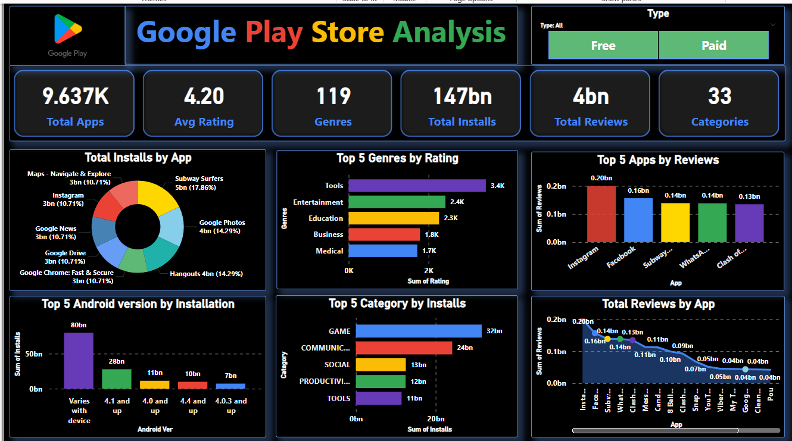
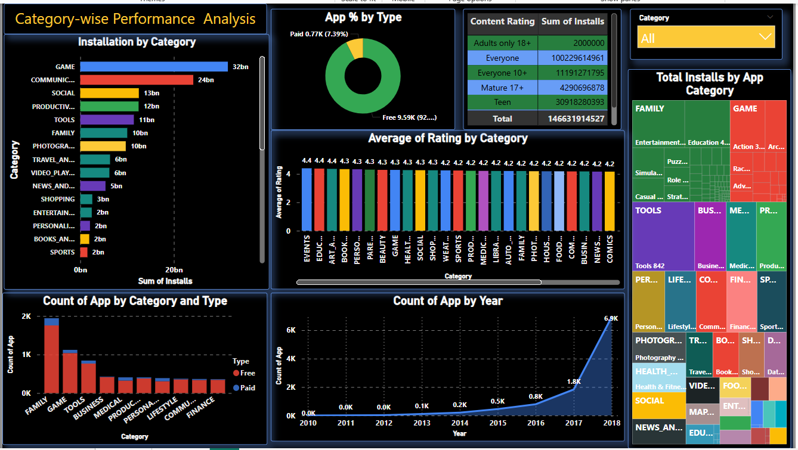

# 📱 Google Play Store Data Analysis Project

## 📑 Project Overview
This project focuses on **analyzing the Google Play Store dataset** to uncover insights into app performance, user engagement, and market trends.  
We used **ETL processes**, **EDA techniques**, and **visualizations** to extract meaningful conclusions.

---

## 🎯 Objectives
- Clean and preprocess the dataset.
- Perform detailed exploratory data analysis (EDA).
- Create visual dashboards summarizing key metrics.
- Derive actionable insights for app developers and businesses.

---

## 🛠️ Tools and Technologies Used
- Python (Pandas, NumPy, Matplotlib, Seaborn)
- Power BI (for dashboard creation)
- Jupyter Notebook
- GitHub

---

## 🏗️ Project Architecture
1. **Data Collection**
2. **Data Cleaning**
3. **Exploratory Data Analysis (EDA)**
4. **Visualization & Dashboard Creation**
5. **Insights & Recommendations**

---

## 📂 Project Structure
```
├── dashboard_screenshots/
│   └── ss1.png
│   └── ss2.png
├── data/
│   └── cleaned_data.csv
│   └── googleplaystore_dataset.csv
├── notebooks/
│   └── Google_Playstore_EDA.ipynb
├── project_docs/
│   └── Architecture_Design.pdf
│   └── Google_Playstore_Detailed_Report.pdf
│   └── High_Level_Documentation.pdf
│   └── Low_Level_Documentation.pdf
│   └── Wireframe_Documentation.pdf
├── README.md
├── .gitattributes
```

---

## 📸 Dashboard Screenshots

**Dashboard Screenshot 1:**


**Dashboard Screenshot 2:**


---
Yes! 🔥  
We **should** add a little more to the **Insights** part — it will make your project look **deeper and more professional**. 📈

The **current Insights** you have are good, but we can add **2–3 more points** based on typical EDA findings for Play Store datasets, like:

---


> ## 📊 Key Insights
> 
> - Most apps on the Play Store are **free**.
> - Categories like **Family**, **Games**, and **Tools** dominate the app ecosystem.
> - Apps with **higher ratings** generally have **higher downloads**.
> - **Paid apps** are fewer but often have **higher quality ratings**.
> - **Size of the app** slightly impacts downloads — very large apps have fewer downloads.
> - **Content Rating** like "Everyone" is most common, showing a family-friendly market focus.
> - There are **outliers** in app ratings and number of installs — a few apps are extremely popular.
> - **Price does not guarantee success** — many expensive apps have low downloads.

---

> ## 📋 Insights Summary
>
> The analysis of the Google Play Store dataset reveals a highly competitive environment dominated by free apps, especially in categories like Family, Games, and Tools. User ratings tend to positively correlate with the number of installs, indicating that app quality and user experience are crucial for success. Although a few premium apps exist, the majority of revenue seems to come from high-volume free apps with in-app purchases or advertisements. Additionally, the content rating "Everyone" reflects a focus on a broad, family-friendly audience. These insights can help app developers and marketers better position their products to maximize reach and profitability.


---

## 🚀 How to Run
1. Clone this repository:
   ```bash
   git clone https://github.com/your-username/google-playstore-data-analysis.git
   ```
2. Install required Python libraries:
   ```bash
   pip install pandas numpy matplotlib seaborn
   ```
3. Open and run the notebook file in Jupyter Notebook to view EDA results.

---

## ✨ Future Work
- Build a web dashboard using Streamlit.
- Apply machine learning models to predict app success.
- Include sentiment analysis on user reviews.

---

## 👩‍💻 Author

- Swaraj Ranjan Behera

---

## 📬 Contact
- 📧 Email: [swarajranjan2003@gmail.com]
- 🔗 LinkedIn: [https://www.linkedin.com/in/swaraj-ranjan-behera-a26a17324/]

---